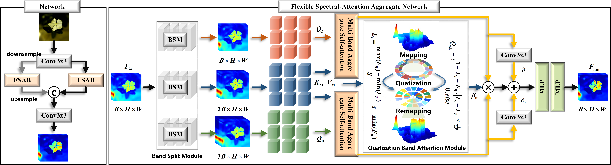
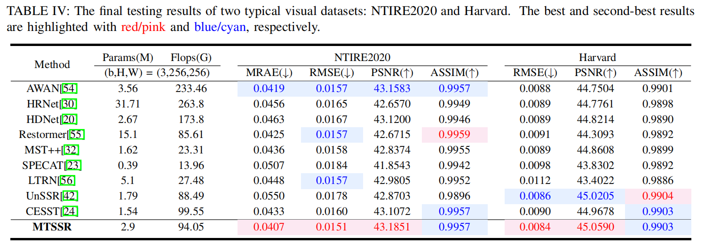
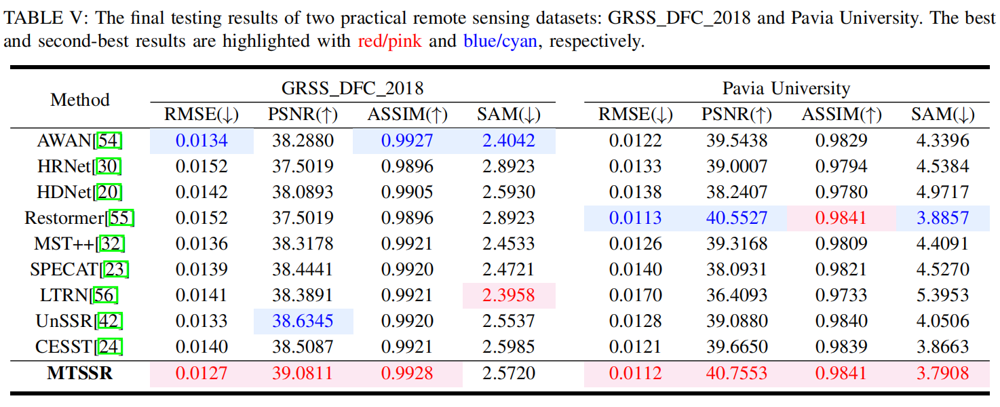
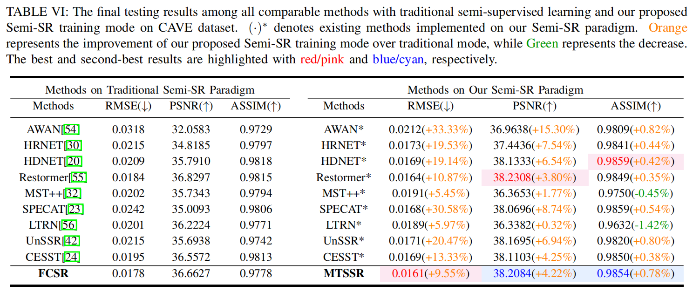

# Towards Memory-efficient Hyperspectral Image Reconstruction via Consistency Learning

 [Yihong Leng](https://scholar.google.com/citations?user=eBel2B8AAAAJ&hl=en&oi=ao), [Jiaojiao Li](https://scholar.google.com/citations?user=Ccu3-acAAAAJ&hl=zh-CN&oi=ao),  [Rui Song](https://scholar.google.com/citations?user=_SKooBYAAAAJ&hl=zh-CN&oi=sra), [Haitao Xu](https://people.ucas.ac.cn/~0067257), [Yunsong Li](), and [Qian Du]() 

⭐ Our work has been accepted by IEEE Transactions on Image Processing 2026.⭐

<hr />

> **Abstract:** Spectral reconstruction (SR) aims to recover high-quality hyperspectral images (HSIs) from more readily available RGB or multispectral images (MSIs). While supervised SR has shown promising results, it is hindered by the difficulty of collecting abundant, well-registered RGB-HSI or MSI-HSI pairs. Semi-supervised SR (Semi-SR) offers a more practical solution by exploiting plentiful RGBs/MSIs together with limited HSIs. However, existing Semi-SR approaches still suffer from cross-domain discrepancies, cross-modality inconsistency, and unreliable pseudo-labels. To tackle these challenges, we propose a Manifold-aware Teacher-Student Semi-SR (MTSSR) framework, which seamlessly integrates labeled and unlabeled domains through a teacher-student paradigm and memory-efficient consistency learning. At its core, a Flexible Cross-attention Spectral Reconstruction (FCSR) network extracts scene-related spatial cues via customized self-attention and models scene-agnostic priors through dynamic quantization, thereby enhancing spectral fidelity. Furthermore, a manifold-aware dimensionality analysis derives a latent space that jointly captures spatial and spectral structures across modalities. This enables a manifold-aware alignment loss to enforce cross-modality consistency and a manifold-aware contrastive loss to progressively refine pseudo-label reliability. In addition, we develop a Threshold-adjusted Memory Bank Update (TMBU) strategy, which generates reliable negative samples by storing network-driven representations instead of memory-consuming HSIs, significantly reducing memory consumption. Extensive experiments on three visual and two remote sensing benchmarks demonstrate that MTSSR consistently outperforms state-of-the-art SR methods, achieving robust and memory-efficient spectral reconstruction.
<hr />

## Flowchart of our MTSSR paradigm for Semi-SR


## Our FCSR Framework




## Results




## Paradigm Comparisons

A comparison with traditional Semi-SR paradigm:



## How to Besign

## Latent Dimension Analysis

For the latent space analysis in this paper, we can obtain a common latent space dimension through Isomap analysis of NTIRE, Harvard, CAVE, GRSS_DFC_2018, UP, which provides data support for why we use latent space loss.


## Train
#### 1. **Created Environment.**

- anaconda NVIDIA GPU

- torch-1.9.0+cu111-cp37-cp37m-linux_x86_64

- torchvision-0.10.0+cu111-cp37-cp37m-linux_x86_64

- ```shell
  # next
  pip list --format=freeze > requirements.txt
  ```

#### 2. Download the dataset.

- Download the training spectral images ([Google Drive](https://drive.google.com/file/d/1FQBfDd248dCKClR-BpX5V2drSbeyhKcq/view))
- Download the training RGB images ([Google Drive](https://drive.google.com/file/d/1A4GUXhVc5k5d_79gNvokEtVPG290qVkd/view))
- Download  the validation spectral images ([Google Drive](https://drive.google.com/file/d/12QY8LHab3gzljZc3V6UyHgBee48wh9un/view))
- Download the validation RGB images ([Google Drive](https://drive.google.com/file/d/19vBR_8Il1qcaEZsK42aGfvg5lCuvLh1A/view))

#### 3. Data Preprocess.

```
train_data_preprocess2.py
valid_data_preprocess3.py
```

To maintain the same split as ours, you can get the details in .\data_split\NTIRE.txt.

#### 4. Training.

```shell
python train2.py
```
The data generated during training will be recorded in `/results/`.
## Test
```shell
python test_model1_entire.py
```
- Our trainable parameters, logs, pth, and final mat, have been put in the fold ''results''. The reconstructed HSI can be obtained in [0108](https://pan.baidu.com/s/1OcVI9YiiLe6gIDHHdLvvJA)  
  
## Citation
If you find this code helpful, please kindly cite:
```shell
# MTSSR
@ARTICLE{MTSSR,
  author={Leng, Yihong and Li, Jiaojiao and Song, Rui and Xu, Haitao and Li, Yunsong and Du, Qian},
  journal={IEEE Transactions on Image Processing}, 
  title={Towards Memory-efficient Hyperspectral Image Reconstruction via Consistency Learning}, 
  year={2026},
  volume={},
  number={},
  pages={1-1},
  keywords={Feeds;Frequency modulation;Radio broadcasting;Filtering;Filters;Pixel;Frequency modulation;Modulation;Electronic mail;Radio broadcasting;semi-supervised;contrastive learning;spectral reconstruction;memory bank;hyperspectral image reconstruction},
  doi={10.1109/TIP.2026.3680005}}
```

## Acknowledgement

****The training code architecture is based on the [Semi-UIR](https://github.com/Huang-ShiRui/Semi-UIR) and thanks for their work. We also thank for the following repositories:  **[AWAN](https://github.com/Deep-imagelab/AWAN)**, [HRNet](https://github.com/zhaoyuzhi/Hierarchical-Regression-Network-for-Spectral-Reconstruction-from-RGB-Images), **[HDNet](https://github.com/Huxiaowan/HDNet)**, [Restormer](https://github.com/swz30/Restormer), [MST-plus-plus](https://github.com/caiyuanhao1998/MST-plus-plus), [SPECAT](https://github.com/THU-luvision/SPECAT), [LTRN](https://github.com/renweidian/LTRN), [Uncertainty-guided-UnSSR](https://github.com/SuperiorLeo/Uncertainty-guided-UnSSR), and [CESST](https://github.com/AlexYangxx/CESST).****

